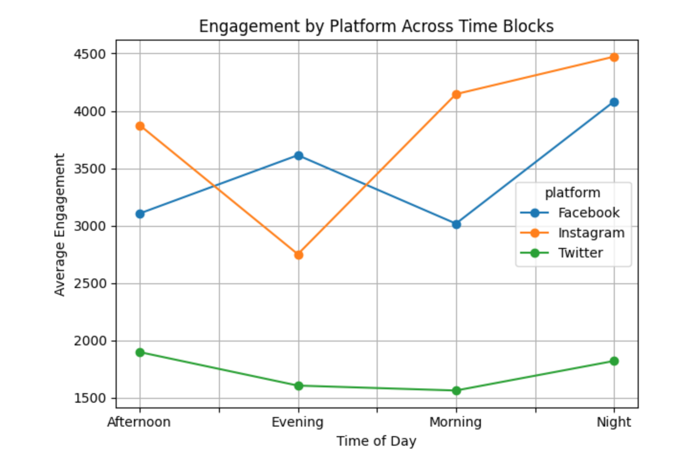
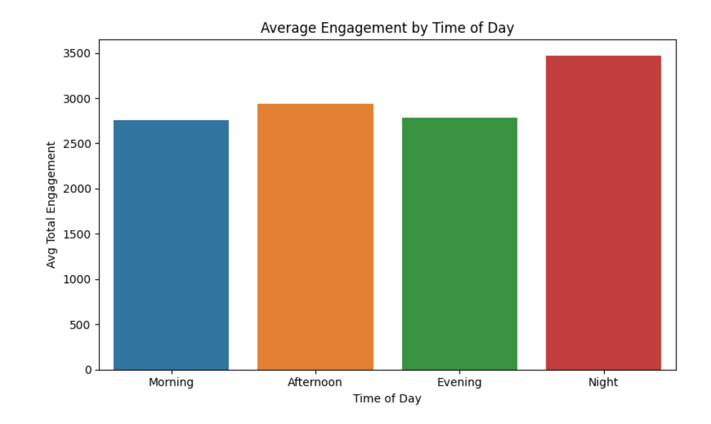
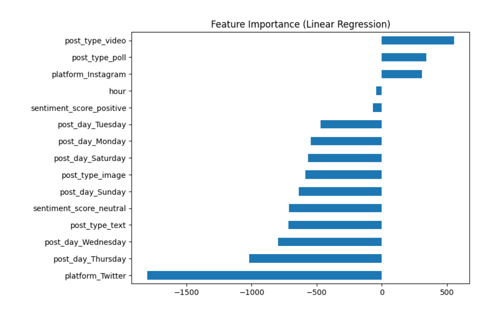
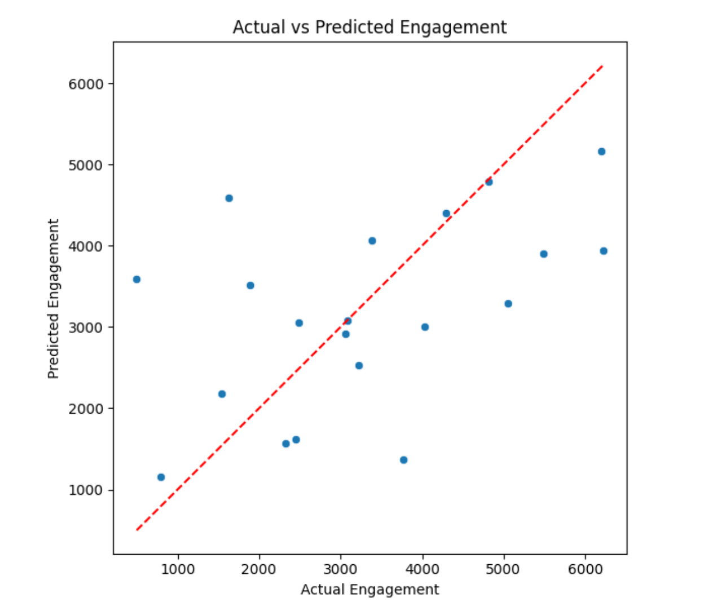

# Social Media Engagement Prediction

**Dataset:** 100 posts across Facebook, Instagram, and Twitter  
**Notebook on Kaggle:** [View here](https://www.kaggle.com/code/umidakhonmuratbekova/engagement-prediction)  
**YouTube Video (Norwegian):** [Watch here](https://lnkd.in/dWdhntiC)

---

## 📌 Goal
To analyze what drives engagement (likes + comments + shares) on social media posts, and test simple models for predicting engagement.

---

## 📊 Key Insights
1. ✅ **Videos and polls win**  
   Video posts had the strongest positive impact on engagement, followed by polls. Text and image posts reduced engagement compared to the baseline.

2. 📱 **Instagram leads the way**  
   Instagram posts generated the highest average engagement — more than Facebook or Twitter.

3. 🌙 **Night-time posts perform best**  
   Posts shared between 11pm and 5am received the most engagement on average.

4. 📈 **Model results**  
   Tested 3 models — Linear Regression, Random Forest, Gradient Boosting.  
   Surprisingly, **Linear Regression performed best** (likely due to small dataset and clear patterns).

---

## 🔧 Tools
- Python (Pandas, Matplotlib, Scikit-learn)  
- Jupyter Notebook  

---

## 🖼️ Visuals

### Engagement by Platform

### Average Engagement

### Feature Importance (Linear Regression)

### Actual vs Predicted

---

## 🚀 Next Steps
- Scale up with larger datasets  
- Test advanced feature engineering (hashtags, captions, sentiment)  
- Compare performance with deep learning models  

---

## 📂 Repository Structure
